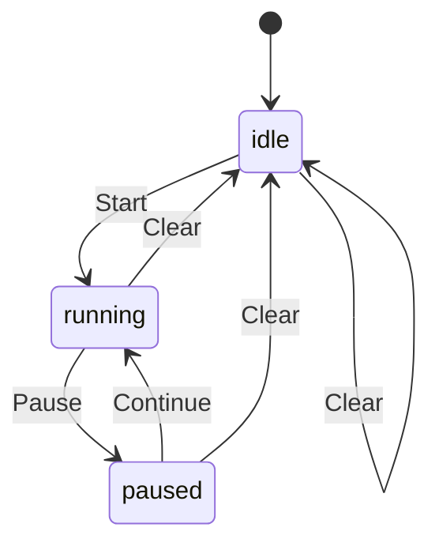
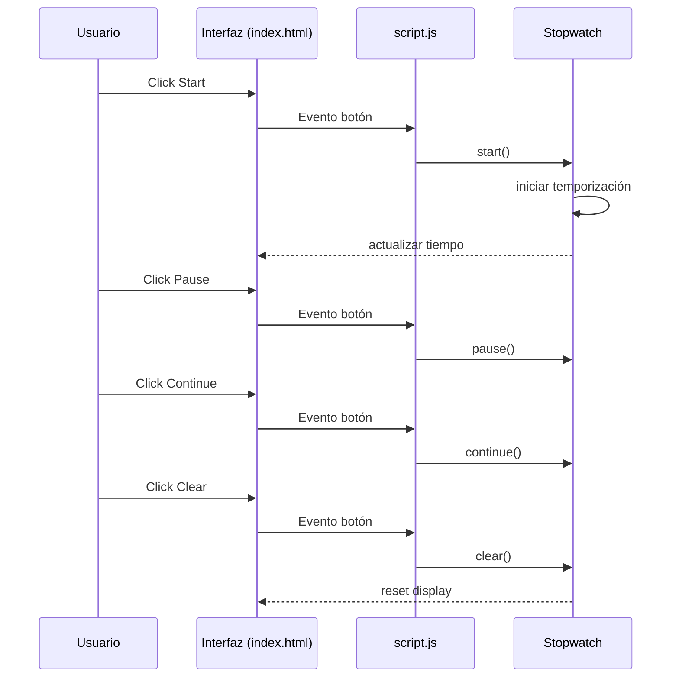

# Stopwatch Web Application

## Descripción
Aplicación web de cronómetro que permite iniciar, pausar, continuar y reiniciar un contador de tiempo mostrado en pantalla con precisión de milisegundos.

## Tecnologías
- HTML5
- CSS3
- JavaScript (Vanilla)

No se utilizan frameworks ni librerías externas.

## Estructura del proyecto
index.html
styles.css
script.js

Diagrama de estados del cronómetro:

### index.html
Define la estructura de la interfaz:
- Panel de visualización del tiempo.
- Indicador de milisegundos.
- Botón principal dinámico (Start / Pause / Continue).
- Botón Clear.

Incluye las referencias a `styles.css` y `script.js`.

### styles.css
Define los estilos visuales de la aplicación:
- Contenedor centrado en la pantalla.
- Panel del cronómetro con fondo gris claro y borde visible.
- Botones con borde y colores según su función.
- Reglas responsive para pantallas más pequeñas.

### script.js
Implementa la lógica del cronómetro:
- Clase `Stopwatch` que gestiona el tiempo y el estado.
- Eventos para la interacción con los botones.
- Actualización del tiempo mostrado en la interfaz.

## Formato del tiempo

El cronómetro muestra el tiempo con el formato:
HH:MM:SS MS

donde:

- HH: horas  
- MM: minutos  
- SS: segundos  
- MS: milisegundos  

## Funcionalidad

**Start**
- Inicia el cronómetro desde cero.
- El botón cambia a `Pause`.

**Pause**
- Detiene el conteo manteniendo el tiempo actual.
- El botón cambia a `Continue`.

**Continue**
- Reanuda el cronómetro desde el tiempo pausado.
- El botón vuelve a `Pause`.

**Clear**
- Reinicia el tiempo a `00:00:00 000`.
- Restablece el estado inicial de la aplicación.

Diagrama de secuencia de interacción:
Representa **cómo interactúan el usuario, la interfaz y la clase `Stopwatch`** durante el uso del cronómetro.

## Lógica interna

La lógica del cronómetro está encapsulada en la clase:

`Stopwatch`

Responsabilidades principales:
- Controlar el estado del cronómetro.
- Calcular el tiempo transcurrido.
- Actualizar el tiempo mostrado en la interfaz.

### Estados utilizados

- `idle`
- `running`
- `paused`

## Temporización

El cálculo del tiempo utiliza:

- `performance.now()`
- `requestAnimationFrame()`

El contador se actualiza en cada ciclo de renderizado del navegador.

## Flujo de ejecución de tests

Los tests se ejecutan en Node:
- `node unit-tests.js`

Flujo:

unit-tests.js
     │
     ├─ Ejecuta tests
     │
     ├─ Recoge resultados
     │
     ├─ Genera timestamp
     │
     └─ Escribe archivo
          test-results.md
